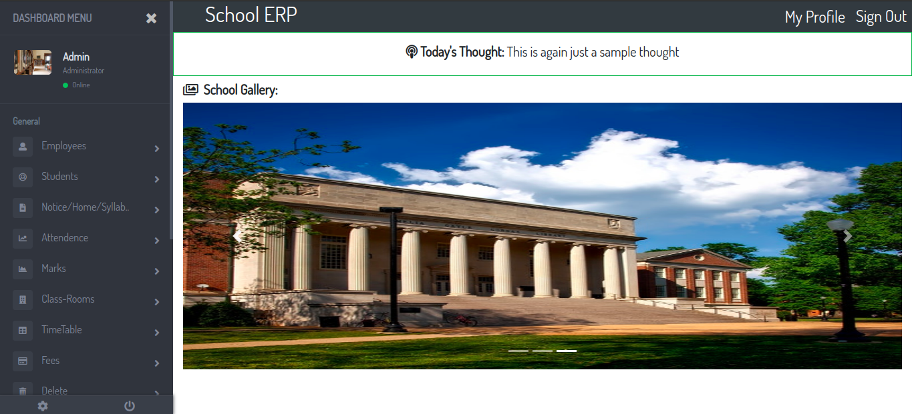
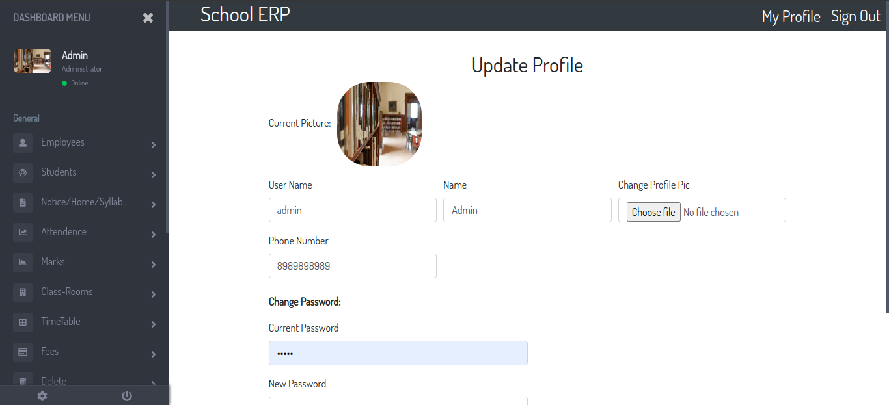
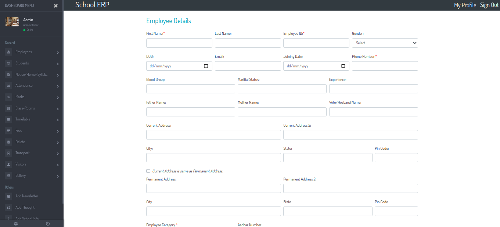
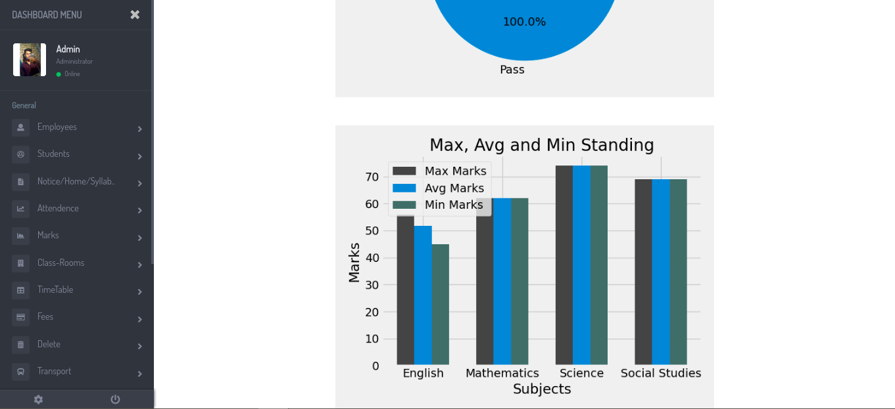
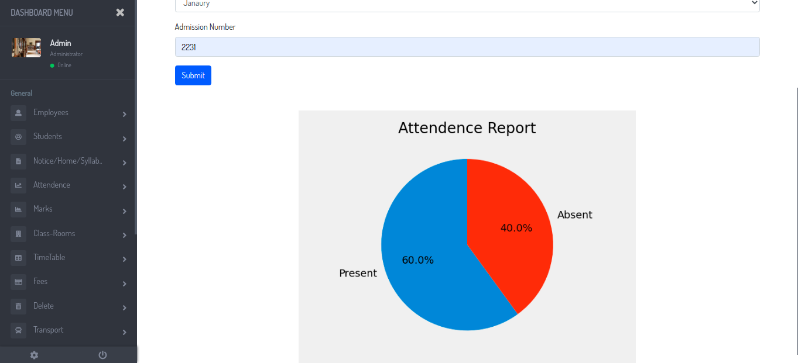
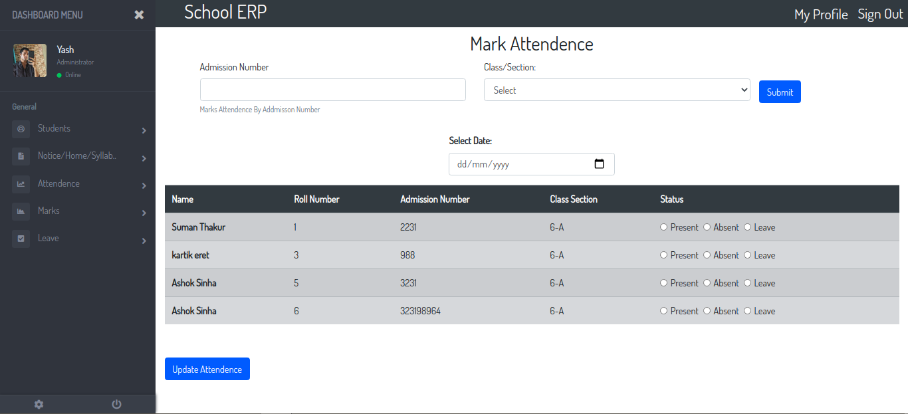
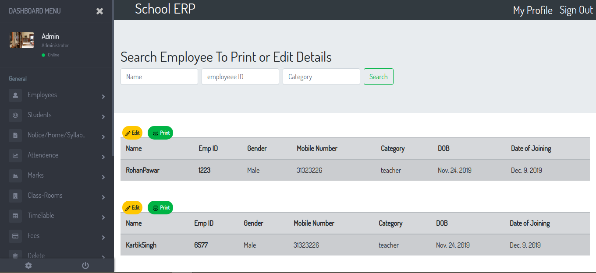
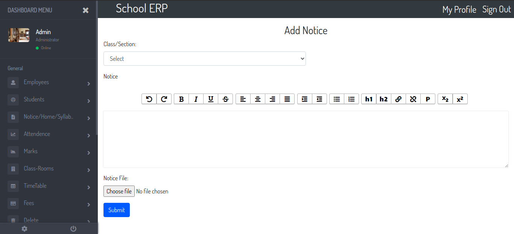

# SchoolERP

## ***Some of the screenshots of the many tabs in the ERP*** 
## Dashboard Page

&nbsp;

## Update ERP Profile 

&nbsp;

## Add Employees/ Student Details 

&nbsp;

## Classwise Marks Comparison

&nbsp;

## Attendance Graph

&nbsp;

## Mark Attendance

&nbsp;

## Chcek Employees/Student Details

&nbsp;

## Write Notice to Students



&nbsp;
&nbsp;


## Steps to setup project on your local machine


### Clone the project to your PC

```
git clone git@github.com:yashboura303/School_ERP.git
```

### Change into project directory
```
cd 'project name'
```

### Install requirements
```
pip install requirements.txt
```

### Create database

For postgresql change engine in settings.py/DATABASES

    'django.db.backends.postgresql_psycopg2'

 `Change the user and password according to your database servers`

 `Create new database and set 'NAME' : <database_name>`

### Makemigrations and migrate

```
python manage.py makemigrations

python manage.py migrate
```

### Start the development server

```
python manage.py runserver
```